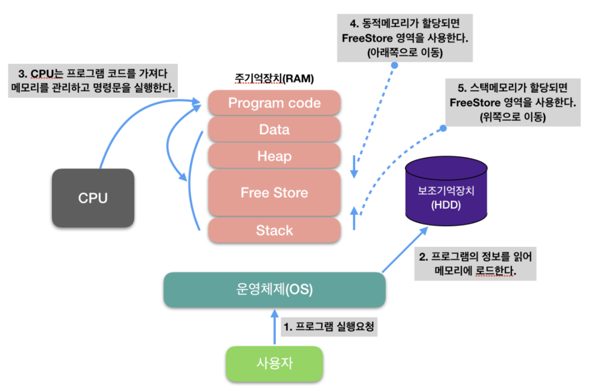

## 메모리 관리를 하는 이유?

> 비효율적인 메모리 관리는 응용 프로그램, 서버 구성요소가 느려진다.\
메모리 누수는 종종 테스트 및 디버깅에 많은 시간을 소비\
데이터 처리에 혼란, 동시 처리 문제가 생긴다.

## 🙉 프로그램 실행 순서

프로그램이 실행하게 되면 OS는 `메모리(RAM)`에 공간을 할당

`RAM 이란?`

> SSD나 하드디스크 같은 것들은 저장을 한번 하면 지워지지 않는다.\
빠른 구동을 위해 임시적으로 저장해 놓는 공간

## 🙉 프로그램이 운영체제로 부터 할당받는 대표적인 메모리 공간

1. 코드(code) 영역
2. 데이터(data) 영역
3. 스택(stack) 영역
4. 힙(heap) 영역

> 코드 영역

실행할 프로그램의 코드가 저장되는 영역으로 텍스트 영역이라고도 부릅니다.

CPU는 코드 영역에 저장된 명령어를 하나씩 가져가서 처리합니다.

> 데이터 영역

프로그램의 전역 변수와 정적 변수가 저장되는 영역입니다.

프로그램의 시작과 함께 할당되며, 프로그램이 종료되면 소멸합니다.

> 스택 영역

함수의 호출과 함께 할당되는 지역 변수와 매개변수가 저장되는 영역

함수의 호출이 완료되면 소멸합니다.

LIFO(Last In First Out) 구조: 마지막으로 들어간 데이터를 먼저 가져오는 구조

> 힙 영역

사용자가 직접 관리할 수 있는 메모리 영역