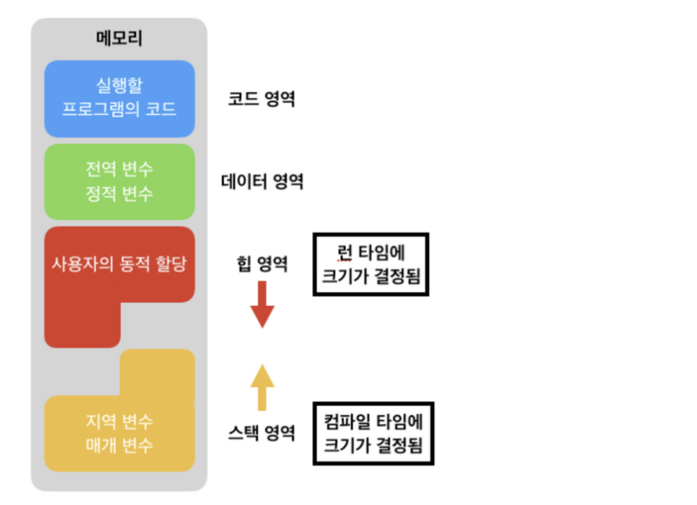

## 🙉 스택과 힙의 차이

> 한마디 요약\
스택은 정적 메모리를 힙은 동적 메모리가 저장되는 영역입니다. 스택은 함수,지역변수,매개변수가 저장되며 LIFO 방식으로 관리되지만 힙 영역은 전역 변수를 다루며 사용자가 직접 관리해야 하는 메모리 영역입니다. 

### ⭐️ 스택
- 정적 메모리 할당
- 함수의 호출과 관계되는 지역 변수와 매개변수가 저장되는 영역
- 함수의 호출과 함께 할당되며, 함수의 호출이 완료되면 소멸
- 푸시(push) 동작으로 데이터를 저장하고, 팝(pop) 동작으로 데이터를 인출
- 후입선출(LIFO, Last-In First-Out) 방식
- 메모리의 높은 주소에서 낮은 주소의 방향으로 할당

> 장점

매우 빠른 액세스(할당,해제가 빠르다)\
변수를 명시적으로 할당 해제 할 필요가 없다.

> 단점

메모리 크기 제한\
지역 변수만

### ⭐️ 힙
- 동적 메모리 할당
- 사용자가 직접 관리할 수 있는 ‘그리고 해야만 하는’ 메모리 영역
- 사용자에 의해 메모리 공간이 동적으로 할당되고 해제
- 메모리의 낮은 주소에서 높은 주소의 방향으로 할당

> 장점

변수는 전역적으로 액세스 할 수 있다.\
메모리 크기 제한이 없다.

> 단점

상대적으로 느린 액세스(할당,해제가 느리다)\
메모리를 관리해야 한다.(변수를 할당하고 해제하는 책임이 있다)\
운영체제마다 메모리 관리가 다르기 때문에 어렵다.