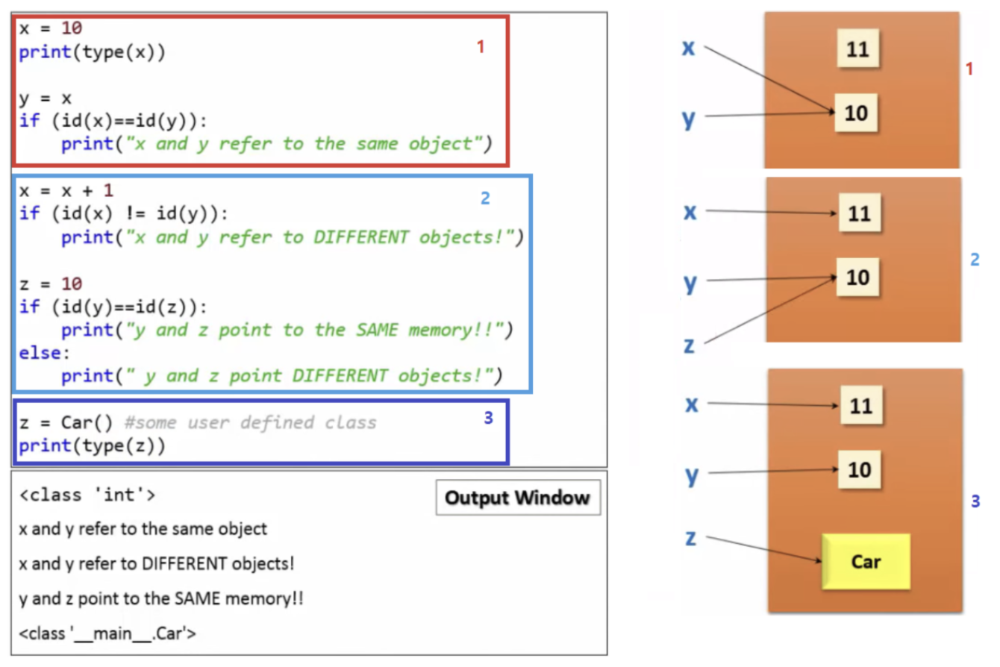
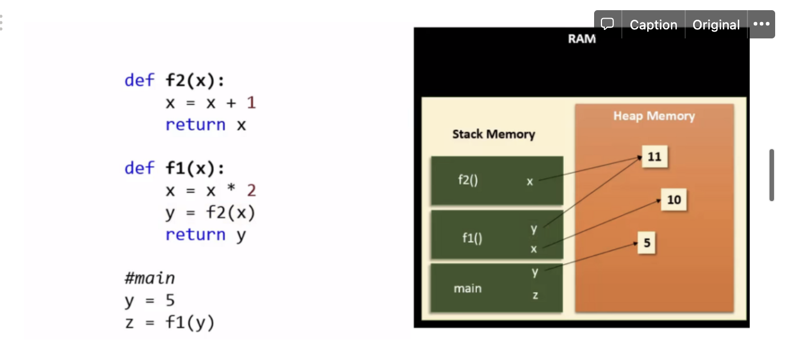
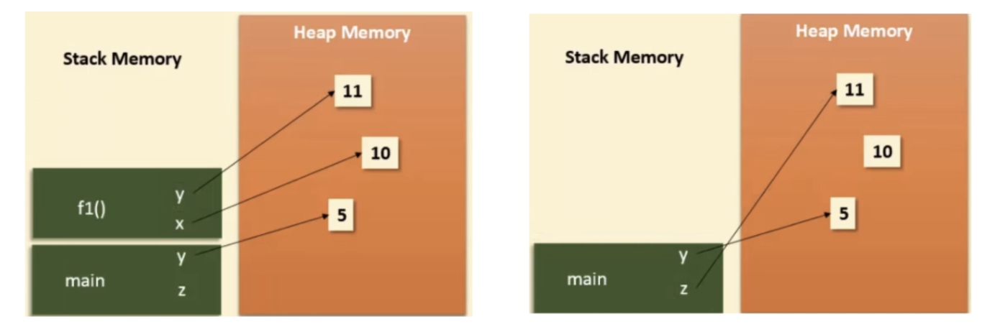

## 🙉 파이썬에서 메모리 관리는?

> C/C++과 같이 프로그래머가 직접 메모리 관리를 하지 않고 레퍼런스 카운트(Reference Counts)와 가비지 컬렉션(Automatic Garbage Collection)에 의해 관리됩니다.

## 관리1 : 레퍼런스 카운트
`레퍼런스 카운트`
- 객체 마다 레퍼런스를 카운트한다. 객체를 참조하는 레퍼런스가 추가될 때 증가하고, 참조가 삭제될 때 감소한다. 이 때 0이 되면 메모리가 할당 해제됩니다.
- 레퍼런스 카운트는 가비지 컬렉션이라고도 불린다.

`빨간색 상자`
- 10이라는 int 객체를 만들고 x 가 가르키는 형태
- y = x 는 x 가 가르키는 객체를 y가 똑같이 가르킨다는 의미
- id() 를 사용하면 두 변수가 같은 id 값을 갖고 있는 것을 알 수 있다. 

`하늘색 상자`
- x = x + 1 일 때는 x 가 11이라는 새로운 객체를 레퍼런스하게 된다.
- z = 10 은 이미 10이라는 객체가 있기 때문에 해당 객체를 레퍼런스하게 된다.

`파란색 상자`
- Car() 라는 객체를 z가 가르킨다.

- 함수가 호출되면 함수와 변수(레퍼런스)는 호출된 순서대로 스택 메모리에 할당되고
- 함수 안의 변수의 데이터는 힙 메모리에 할당된다.
- 함수 호출이 끝나면(return) 스택에 나중에 호출된 함수부터 메모리 할당이 해제된다.(`Last In First Out`)

`Last In First Out`
> 스택 메모리의 특징으로 나중에 할당된 메모리가 먼저 해제됩니다.(후입선출)

## 관리2: Automatic Garbage Collection
`Automatic Garbage Collection`
- 레퍼런스 카운트의 문제점인 순환 참조 이슈를 해결하기 위해 구현한 가비지 컬렉션

---
`참고자료`

- [끄적끄적](https://leemoney93.tistory.com/25)